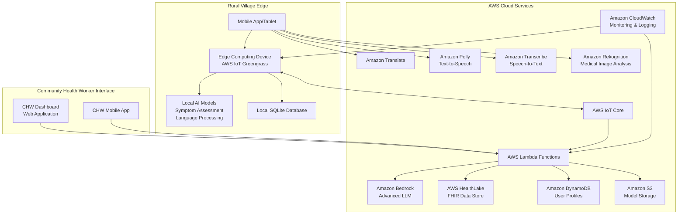

# Design Document: RuralCare AI

## Overview

RuralCare AI is a hybrid cloud-edge healthcare assistance system designed for rural Indian villages. The system combines AWS cloud services with edge computing capabilities to provide reliable healthcare guidance in both connected and disconnected environments. The architecture leverages AWS IoT Greengrass for offline AI inference, Amazon Bedrock for advanced language models, and AWS HealthLake for secure health data management.

The system addresses the unique challenges of rural healthcare delivery through a multi-modal interface supporting voice, text, and image inputs in multiple Indian languages. By deploying lightweight AI models at the edge while maintaining cloud connectivity for advanced features, RuralCare AI ensures consistent healthcare access regardless of network conditions.

## Architecture

### High-Level Architecture



### Edge Computing Architecture

The edge computing layer uses AWS IoT Greengrass to enable offline functionality:

- **Local AI Models**: Lightweight versions of symptom assessment and language processing models
- **Data Synchronization**: Automatic sync when connectivity is restored
- **Local Storage**: SQLite database for offline data persistence
- **Model Updates**: Automatic deployment of updated models from the cloud

### Cloud Services Integration

**Core Services:**
- **Amazon Bedrock**: Advanced language models for complex health queries
- **AWS HealthLake**: FHIR-compliant health data storage and analytics
- **AWS IoT Core**: Device management and secure communication
- **Amazon S3**: Model storage and health education content

**AI/ML Services:**
- **Amazon Transcribe**: Multi-language speech recognition
- **Amazon Polly**: Natural-sounding text-to-speech in Indian languages
- **Amazon Translate**: Real-time language translation
- **Amazon Rekognition**: Medical image analysis for visible symptoms

## Components and Interfaces

### 1. Multi-Modal Input Handler

**Purpose**: Process voice, text, and image inputs from users

**Interfaces:**
```typescript
interface InputHandler {
  processVoiceInput(audioData: AudioBuffer, language: string): Promise<ProcessedInput>
  processTextInput(text: string, language: string): Promise<ProcessedInput>
  processImageInput(imageData: ImageBuffer): Promise<ProcessedInput>
  detectLanguage(input: string | AudioBuffer): Promise<string>
}

interface ProcessedInput {
  type: 'voice' | 'text' | 'image'
  content: string
  language: string
  confidence: number
  metadata: Record<string, any>
}
```

**Implementation Details:**
- Uses Amazon Transcribe for speech-to-text conversion
- Integrates with Amazon Translate for language detection and translation
- Employs Amazon Rekognition for medical image analysis
- Maintains offline fallback using local speech recognition models

### 2. Health Assessment Engine

**Purpose**: Analyze symptoms and provide health guidance

**Interfaces:**
```typescript
interface HealthAssessmentEngine {
  assessSymptoms(symptoms: SymptomData): Promise<HealthAssessment>
  triagePatient(assessment: HealthAssessment): Promise<TriageResult>
  generateRecommendations(assessment: HealthAssessment): Promise<Recommendation[]>
  checkEmergencyConditions(symptoms: SymptomData): Promise<EmergencyStatus>
}

interface SymptomData {
  symptoms: string[]
  duration: string
  severity: number
  patientAge: number
  patientGender: string
  additionalContext: Record<string, any>
}

interface HealthAssessment {
  riskLevel: 'low' | 'medium' | 'high' | 'emergency'
  possibleConditions: Condition[]
  confidence: number
  requiresProfessionalCare: boolean
}

interface TriageResult {
  urgency: 'immediate' | 'urgent' | 'routine' | 'self-care'
  recommendedAction: string
  timeframe: string
  referralNeeded: boolean
}
```

**Implementation Details:**
- Uses trained ML models for symptom pattern recognition
- Implements rule-based emergency detection for critical conditions
- Maintains local lightweight models for offline assessment
- Integrates with Amazon Bedrock for complex diagnostic reasoning

### 3. Language Processing Service

**Purpose**: Handle multi-language communication and cultural context

**Interfaces:**
```typescript
interface LanguageProcessor {
  translateText(text: string, fromLang: string, toLang: string): Promise<string>
  synthesizeSpeech(text: string, language: string, voice: string): Promise<AudioBuffer>
  detectLanguage(input: string): Promise<LanguageDetection>
  localizeContent(content: string, language: string, region: string): Promise<string>
}

interface LanguageDetection {
  language: string
  confidence: number
  dialect?: string
  region?: string
}
```

**Supported Languages:**
- Hindi, English, Tamil, Telugu, Bengali, Marathi, Gujarati
- Regional dialects and cultural context adaptation
- Medical terminology localization

### 4. Emergency Response System

**Purpose**: Handle urgent medical situations and referrals

**Interfaces:**
```typescript
interface EmergencyResponseSystem {
  detectEmergency(symptoms: SymptomData): Promise<EmergencyDetection>
  initiateEmergencyProtocol(emergency: EmergencyDetection): Promise<EmergencyResponse>
  findNearestFacilities(location: GeoLocation, emergencyType: string): Promise<HealthcareFacility[]>
  logEmergencyEvent(event: EmergencyEvent): Promise<void>
}

interface EmergencyDetection {
  isEmergency: boolean
  emergencyType: string
  severity: number
  immediateActions: string[]
}

interface EmergencyResponse {
  protocolActivated: boolean
  contactsNotified: string[]
  facilitiesContacted: HealthcareFacility[]
  firstAidInstructions: string[]
}
```

### 5. Community Health Worker Dashboard

**Purpose**: Provide tools and insights for local healthcare workers

**Interfaces:**
```typescript
interface CHWDashboard {
  getPatientQueue(): Promise<PatientCase[]>
  reviewCase(caseId: string): Promise<PatientCase>
  updateCaseStatus(caseId: string, status: CaseStatus): Promise<void>
  generateCommunityReport(timeframe: string): Promise<CommunityHealthReport>
  accessDecisionSupport(caseId: string): Promise<ClinicalGuidance>
}

interface PatientCase {
  caseId: string
  patientId: string
  symptoms: SymptomData
  assessment: HealthAssessment
  priority: number
  timestamp: Date
  status: CaseStatus
}

interface CommunityHealthReport {
  totalCases: number
  commonConditions: ConditionSummary[]
  emergencyEvents: number
  preventionOpportunities: string[]
  resourceNeeds: string[]
}
```

### 6. Data Synchronization Service

**Purpose**: Manage offline-online data synchronization

**Interfaces:**
```typescript
interface DataSyncService {
  syncToCloud(): Promise<SyncResult>
  syncFromCloud(): Promise<SyncResult>
  handleConflicts(conflicts: DataConflict[]): Promise<ConflictResolution[]>
  getOfflineCapabilities(): Promise<OfflineCapabilities>
}

interface SyncResult {
  success: boolean
  recordsSynced: number
  conflicts: DataConflict[]
  errors: SyncError[]
}

interface OfflineCapabilities {
  availableModels: string[]
  localStorageCapacity: number
  lastSyncTimestamp: Date
  offlineFunctionality: string[]
}
```

## Data Models

### Core Health Data Models

```typescript
// Patient Information
interface Patient {
  patientId: string
  demographics: {
    age: number
    gender: string
    location: GeoLocation
    preferredLanguage: string
  }
  medicalHistory: MedicalHistory[]
  currentSymptoms: SymptomData[]
  riskFactors: string[]
  createdAt: Date
  updatedAt: Date
}

// Medical History
interface MedicalHistory {
  condition: string
  diagnosedDate: Date
  severity: string
  treatment: string
  resolved: boolean
  notes: string
}

// Health Assessment
interface HealthAssessment {
  assessmentId: string
  patientId: string
  symptoms: SymptomData
  aiAssessment: {
    riskLevel: RiskLevel
    possibleConditions: Condition[]
    confidence: number
    reasoning: string
  }
  humanReview?: {
    reviewerId: string
    reviewDate: Date
    finalDiagnosis: string
    treatmentPlan: string
  }
  outcome?: {
    followUpDate: Date
    resolution: string
    patientFeedback: string
  }
}

// Geographic and Facility Data
interface HealthcareFacility {
  facilityId: string
  name: string
  type: 'hospital' | 'clinic' | 'pharmacy' | 'emergency'
  location: GeoLocation
  contact: ContactInfo
  services: string[]
  availability: AvailabilitySchedule
  distance?: number
}

interface GeoLocation {
  latitude: number
  longitude: number
  address: string
  village: string
  district: string
  state: string
  pincode: string
}
```

### AI Model Data Structures

```typescript
// Model Configuration
interface AIModelConfig {
  modelId: string
  modelType: 'symptom-assessment' | 'language-processing' | 'image-analysis'
  version: string
  language: string
  accuracy: number
  modelSize: number
  offlineCapable: boolean
  lastUpdated: Date
}

// Training Data Structure
interface TrainingData {
  datasetId: string
  dataType: 'synthetic' | 'public' | 'anonymized'
  language: string
  medicalDomain: string
  sampleCount: number
  qualityScore: number
  ethicsApproval: boolean
  source: string
}
```

### Offline Data Models

```typescript
// Local Storage Schema
interface OfflineData {
  patientCases: PatientCase[]
  healthAssessments: HealthAssessment[]
  educationContent: EducationContent[]
  facilityDirectory: HealthcareFacility[]
  syncQueue: SyncQueueItem[]
  lastSyncTimestamp: Date
}

interface SyncQueueItem {
  id: string
  operation: 'create' | 'update' | 'delete'
  dataType: string
  data: any
  timestamp: Date
  retryCount: number
}
```

## Correctness Properties

The following properties define the correctness criteria that the RuralCare AI system must satisfy. These properties will be validated through property-based testing using synthetic and public datasets.

### Property 1: Multi-Modal Input Processing Consistency
**Validates: Requirements 1.1, 1.2**

For any valid health query input (voice, text, or image) in supported languages:
- The system SHALL produce a valid ProcessedInput object with confidence > 0.7
- Language detection accuracy SHALL be ≥ 90% for supported languages
- Response content SHALL be culturally appropriate for the detected language/region
- Processing time SHALL not exceed 3 seconds in online mode, 1 second in offline mode

```typescript
property("multi_modal_input_consistency", (input: HealthInput) => {
  const result = processInput(input)
  return result.confidence >= 0.7 && 
         result.language in SUPPORTED_LANGUAGES &&
         result.processingTime <= getMaxProcessingTime(input.mode)
})
```

### Property 2: Offline Functionality Preservation
**Validates: Requirements 2.1, 2.2, 2.5**

When the system operates in offline mode:
- At least 80% of core functionality SHALL remain available
- All offline responses SHALL be deterministic for identical inputs
- Data integrity SHALL be maintained during offline-online transitions
- No data loss SHALL occur during connectivity interruptions

```typescript
property("offline_functionality_preservation", (healthQuery: HealthQuery) => {
  const onlineResult = processQuery(healthQuery, Mode.ONLINE)
  const offlineResult = processQuery(healthQuery, Mode.OFFLINE)
  
  return offlineResult.functionalityScore >= 0.8 &&
         offlineResult.isValid &&
         dataIntegrityMaintained(onlineResult, offlineResult)
})
```

### Property 3: Symptom Assessment Accuracy
**Validates: Requirements 3.1, 3.2, 3.5**

For any valid symptom input:
- Risk categorization SHALL be consistent for similar symptom patterns
- Assessment accuracy SHALL be ≥ 85% for common rural health conditions
- Emergency conditions SHALL be detected with 100% sensitivity
- Assessment confidence SHALL correlate with diagnostic certainty

```typescript
property("symptom_assessment_accuracy", (symptoms: SymptomData) => {
  const assessment = assessSymptoms(symptoms)
  const isEmergency = checkEmergencyConditions(symptoms)
  
  return assessment.confidence >= 0.85 &&
         (isEmergency.isEmergency ? assessment.riskLevel === 'emergency' : true) &&
         assessmentIsConsistent(symptoms, assessment)
})
```

### Property 4: Emergency Detection Reliability
**Validates: Requirements 6.1, 6.2, 6.4**

For any symptom pattern indicating emergency conditions:
- Emergency detection SHALL have 100% sensitivity (no false negatives)
- Emergency protocols SHALL activate within 1 second
- First aid guidance SHALL be provided when emergency services unavailable
- All emergency interactions SHALL be logged for follow-up

```typescript
property("emergency_detection_reliability", (emergencySymptoms: EmergencySymptomData) => {
  const detection = detectEmergency(emergencySymptoms)
  const response = initiateEmergencyProtocol(detection)
  
  return detection.isEmergency === true &&
         response.activationTime <= 1000 &&
         response.protocolActivated &&
         emergencyEventLogged(detection)
})
```

### Property 5: Data Privacy and Security
**Validates: Requirements 7.1, 7.2, 7.3**

For all personal health information:
- Data SHALL be encrypted both in transit and at rest
- User consent SHALL be obtained before data collection
- Only anonymized data SHALL be used for system improvements
- Data deletion requests SHALL be completed within 30 days

```typescript
property("data_privacy_security", (healthData: PersonalHealthData) => {
  const encrypted = encryptData(healthData)
  const consent = obtainConsent(healthData.userId)
  const anonymized = anonymizeData(healthData)
  
  return encrypted.isEncrypted &&
         consent.obtained &&
         anonymized.containsNoPersonalInfo &&
         dataDeletionCompliance(healthData)
})
```

### Property 6: Performance and Scalability
**Validates: Requirements 9.1, 9.2, 9.3**

Under varying system loads:
- Response times SHALL not exceed specified limits
- System SHALL handle concurrent users without degradation
- Auto-scaling SHALL maintain performance during load spikes
- 99.5% uptime availability SHALL be maintained

```typescript
property("performance_scalability", (systemLoad: SystemLoad) => {
  const performance = measurePerformance(systemLoad)
  const scalingResponse = autoScale(systemLoad)
  
  return performance.responseTime <= getMaxResponseTime(systemLoad.mode) &&
         performance.concurrentUsers >= 10000 &&
         scalingResponse.successful &&
         performance.uptime >= 0.995
})
```

### Property 7: Language Processing Accuracy
**Validates: Requirements 8.1, 8.2, 8.4**

For all supported languages and dialects:
- Translation accuracy SHALL be ≥ 90% for health-related content
- Language switching SHALL be seamless mid-conversation
- Medical terminology SHALL use locally understood terms
- Cultural context SHALL be preserved in translations

```typescript
property("language_processing_accuracy", (multilingualInput: MultilingualHealthInput) => {
  const processed = processLanguage(multilingualInput)
  const translated = translateHealthContent(processed)
  
  return translated.accuracy >= 0.9 &&
         translated.culturallyAppropriate &&
         medicalTerminologyLocalized(translated) &&
         languageSwitchingSeamless(multilingualInput)
})
```

### Property 8: System Reliability and Fault Tolerance
**Validates: Requirements 10.1, 10.2, 10.3**

Under various failure conditions:
- System SHALL continue operating in offline mode when cloud services fail
- Graceful degradation SHALL maintain core services during component failures
- Automatic recovery SHALL occur without user intervention
- Data integrity SHALL be maintained during failures and recovery

```typescript
property("system_reliability_fault_tolerance", (failureScenario: FailureScenario) => {
  const systemState = simulateFailure(failureScenario)
  const recovery = attemptRecovery(systemState)
  
  return systemState.coreServicesAvailable &&
         systemState.gracefulDegradation &&
         recovery.automatic &&
         dataIntegrityMaintained(systemState, recovery)
})
```

### Property 9: Bias-Free AI Assessment
**Validates: Requirements 14.1, 14.2**

For diverse patient demographics:
- Health assessments SHALL be consistent regardless of gender, caste, or economic status
- Algorithmic bias SHALL be below acceptable thresholds
- Assessment quality SHALL not vary based on patient demographics
- Fairness metrics SHALL meet established standards

```typescript
property("bias_free_ai_assessment", (diversePatients: DiversePatientData[]) => {
  const assessments = diversePatients.map(patient => assessSymptoms(patient.symptoms))
  const biasMetrics = calculateBiasMetrics(assessments, diversePatients)
  
  return biasMetrics.genderBias <= ACCEPTABLE_BIAS_THRESHOLD &&
         biasMetrics.socioeconomicBias <= ACCEPTABLE_BIAS_THRESHOLD &&
         assessmentConsistencyAcrossDemographics(assessments, diversePatients)
})
```

### Property 10: Impact Measurement Accuracy
**Validates: Requirements 16.1, 16.2, 16.4**

For system usage and health outcome tracking:
- Anonymized metrics SHALL accurately reflect system usage
- Health trend analysis SHALL be statistically valid
- Privacy SHALL be maintained in all aggregated data
- Preventive behavior tracking SHALL show measurable improvements

```typescript
property("impact_measurement_accuracy", (usageData: AnonymizedUsageData) => {
  const metrics = calculateImpactMetrics(usageData)
  const trends = analyzeHealthTrends(metrics)
  
  return metrics.privacyPreserved &&
         trends.statisticallyValid &&
         metrics.accuratelyReflectUsage &&
         preventiveBehaviorImprovement(trends)
})
```

## Testing Strategy

### Property-Based Testing Framework
- **Framework**: Use fast-check (JavaScript/TypeScript) for property-based testing
- **Data Generation**: Create smart generators for health-related synthetic data
- **Test Execution**: Run properties against 1000+ generated test cases
- **Failure Analysis**: Implement shrinking to find minimal failing examples

### Synthetic Data Sources
- **Medical Datasets**: Use publicly available medical datasets (MIMIC-III, eICU)
- **Synthetic Patients**: Generate diverse patient profiles using demographic data
- **Symptom Patterns**: Create realistic symptom combinations based on medical literature
- **Language Samples**: Generate multilingual health queries using public translation datasets

### Testing Environment
- **Edge Testing**: Test offline functionality using AWS IoT Device Simulator
- **Load Testing**: Use AWS Load Testing solution for scalability validation
- **Security Testing**: Implement automated security scanning for data protection
- **Bias Testing**: Use fairness testing frameworks with diverse synthetic populations

Now I need to use the prework tool to analyze the acceptance criteria before writing the Correctness Properties section:
